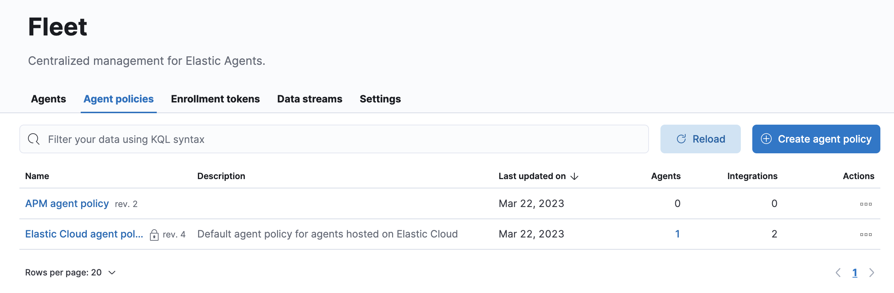
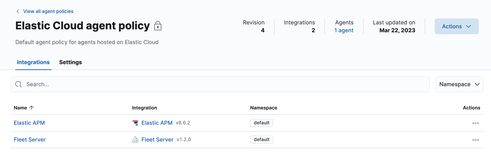
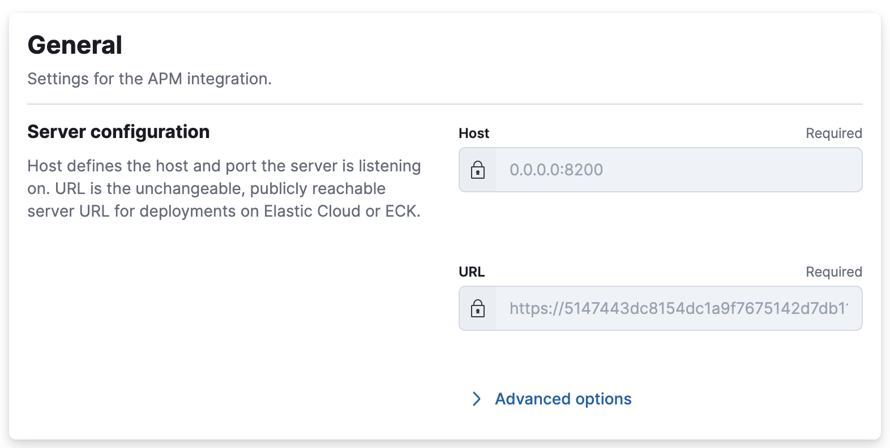
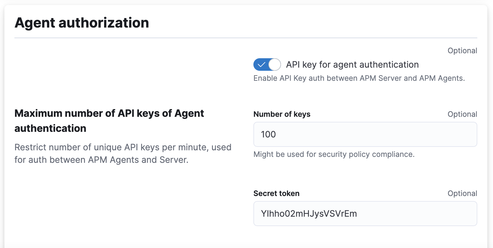

== OpenTelemetry Collector

=== Jaeger + OpenTelemetry Collector

To start the services
----
cd jaeger
docker-compose up -d
----

To shutdown the services
----
cd jaeger
docker-compose down -v
----

=== Elastic APM + OpenTelemetry Collector
Before you start the services, you need to modify the elastic-apm/otel-collector-config.yaml and provide the Elastic APM URL endpoint and the Elastic APM secret token in the respective fields.

.Where to get the info?
- Login to Elastic Cloud
- Navigate to Fleet > Agent policies > Elastic Cloud agent policy 

- Click on Elastic APM

- Find Elastic APM URL under General section

- Find Secret Token under Agent authorization

To start the services
----
cd elastic-apm
docker-compose up -d
----

To shutdown the services
----
cd elastic-apm
docker-compose down -v
----
