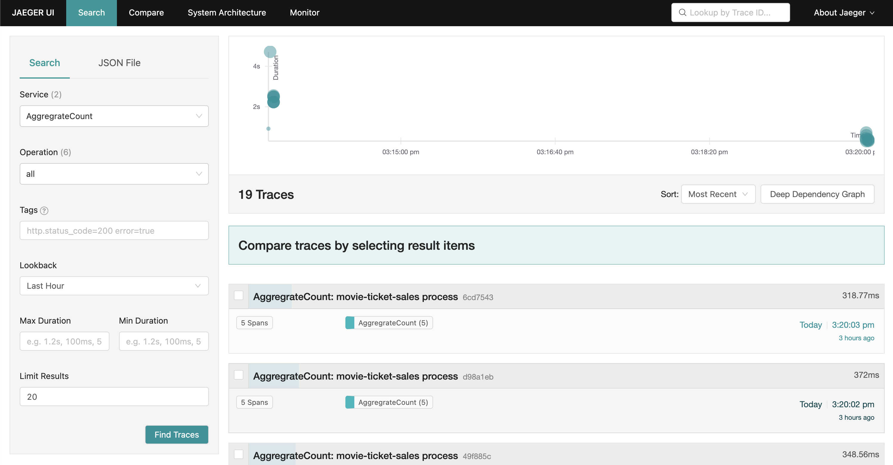
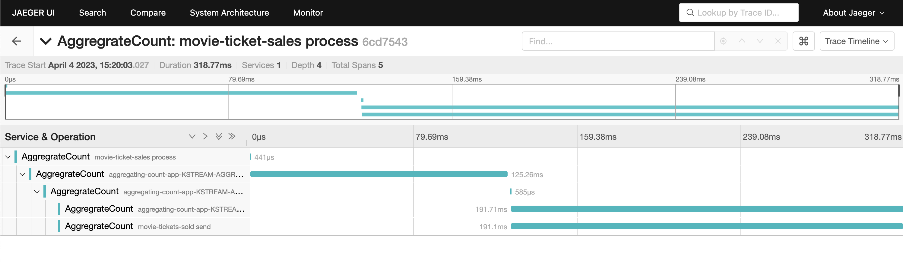

=== Introduction

This repository holds the demo asset in enabling distributed tracing for Stateful Kafka Streams program using OpenTelemetry instrumentation extensions created by the CSID team.

CSID Event Lineage sources - https://github.com/confluentinc/csid-event-lineage[github]

OpenTelemetry documentation and sources - https://opentelemetry.io/[main site], https://github.com/open-telemetry[github]

=== Generate OpenTelemetry instrumentation extensions jar 

Clone / download CSID Event Lineage sources 

----
git clone https://github.com/confluentinc/csid-event-lineage
----

Build OpenTelemetry instrumentation extensions jar

----
cd csid-event-lineage
./gradlew shadowJar
----

Copy the OpenTelemetry instrumentation extensions jar to the desired location

----
cp ./instrumentation/build/libs/lineage-opentel-extensions-0.0.1-SNAPSHOT-all.jar /opt/otel/
----

=== Before running the demo

Modify configuration/dev.properties according to your Confluent Cloud environment

----
bootstrap.servers={{ BOOTSTRAP_SERVERS }}
security.protocol=SASL_SSL
sasl.jaas.config=org.apache.kafka.common.security.plain.PlainLoginModule required username='{{ CLUSTER_API_KEY }}' password='{{ CLUSTER_API_SECRET }}';
sasl.mechanism=PLAIN
client.dns.lookup=use_all_dns_ips
acks=all
schema.registry.url={{ SR_URL }}
basic.auth.credentials.source=USER_INFO
basic.auth.user.info={{ SR_API_KEY }}:{{ SR_API_SECRET }}

input.topic.name=movie-ticket-sales
input.topic.partitions=6
input.topic.replication.factor=3
output.topic.name=movie-tickets-sold
output.topic.partitions=6
output.topic.replication.factor=3
application.id=aggregating-count-app
replication.factor=3
----

Compile the Kafka Stream program

----
./gradlew shadowJar
----

Start the OpenTelemetry Collector

----
cd ./collector/jaeger
docker-compose up -d
----

Browse to http://localhost:16686/[Jaeger UI]

The demo Kafka Streams program should be run with OpenTelemetry https://github.com/open-telemetry/opentelemetry-java-instrumentation/releases/latest/download/opentelemetry-javaagent.jar[javaagent] and instrumentation extension:
----
export OTEL_SERVICE_NAME=AggregrateCount
export OTEL_TRACES_EXPORTER=otlp
export OTEL_METRICS_EXPORTER=none
export OTEL_LOGS_EXPORTER=none

java -javaagent:/opt/otel/opentelemetry-javaagent.jar \
-Dotel.instrumentation.kafka.experimental-span-attributes=true \
-Dotel.instrumentation.common.experimental.suppress-messaging-receive-spans=true \
-Dotel.javaagent.extensions=/opt/otel/lineage-opentel-extensions-0.0.1-SNAPSHOT-all.jar \
-jar build/libs/kstreams-aggregating-count-standalone-0.0.1.jar configuration/dev.properties
----

NOTE: Modify /opt/otel to the path containing the Opentelemetry javaagent and instrumentation extension.

Login to Confluent Cloud and produce events to the input topic

----
cd aggregate-count
confluent login
confluent kafka topic produce movie-ticket-sales \
  --parse-key \
  --delimiter ":" \
  --value-format avro \
  --schema src/main/avro/ticket-sale.avsc
----

Paste the following into the prompt and press enter

----
"Die Hard":{"title":"Die Hard","sale_ts":"2019-07-18T10:00:00Z","ticket_total_value":12}
"Die Hard":{"title":"Die Hard","sale_ts":"2019-07-18T10:01:00Z","ticket_total_value":12}
"The Godfather":{"title":"The Godfather","sale_ts":"2019-07-18T10:01:31Z","ticket_total_value":12}
"Die Hard":{"title":"Die Hard","sale_ts":"2019-07-18T10:01:36Z","ticket_total_value":24}
"The Godfather":{"title":"The Godfather","sale_ts":"2019-07-18T10:02:00Z","ticket_total_value":18}
"The Big Lebowski":{"title":"The Big Lebowski","sale_ts":"2019-07-18T11:03:21Z","ticket_total_value":12}
"The Big Lebowski":{"title":"The Big Lebowski","sale_ts":"2019-07-18T11:03:50Z","ticket_total_value":12}
"The Godfather":{"title":"The Godfather","sale_ts":"2019-07-18T11:40:00Z","ticket_total_value":36}
"The Godfather":{"title":"The Godfather","sale_ts":"2019-07-18T11:40:09Z","ticket_total_value":18}
----

Consume aggregated count from the output topic

----
confluent kafka topic consume movie-tickets-sold -b --print-key
----

=== Sample Telemetry in JaegerUI

=== Compatible OpenTelemetry versions

Both development of extension and installation requires compatible version of main OpenTelemetry Java Instrumentation.

Current build is targeting v1.13.0 of OpenTelemetry instrumentation.
